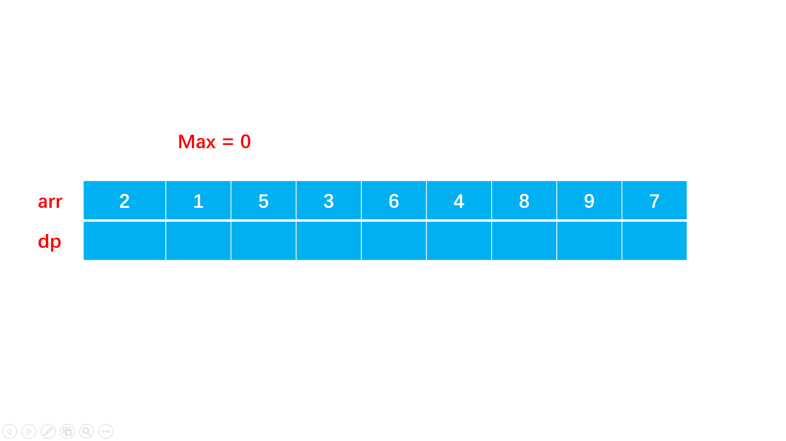

# 线性动态规划

&emsp;&emsp;线性动态规划的主要特点是：**状态的推导是按照问题规模$i$从小到大依次推导过去的，较大规模的问题的解依赖较小规模的问题的解**。这里问题规模$i$的含义是考虑前$i$个元素$[0,...,i]$时问题的解。由此可以看出，大规模问题的状态只与较小规模的问题有关，而问题规模完全用一个变量$i$表示，$i$的大小表示了问题规模的大小，因此从小到大推$i$直至$n$,就得到了大规模问题的解，这就是线性动态规划的过程。

&emsp;&emsp;线性动态规划解决的问题主要是**单串、双串、矩阵**上的问题。因为这些问题完全可以用位置表示，并且**位置的大小就是问题规模的大小**。因此从前往后推位置就相当于从小到大推问题规模。

## 单串问题

&emsp;&emsp;单串$dp[i]$线性动态规划最简单的一类问题，输入是一个串，状态定义为$dp[i] := 考虑[0,..,i]$上，原问题的解。其中$i$位置的处理，根据不同的问题，主要有两个方式:

- 第一种是$i$位置必须取，此时状态可以进一步描述为$dp[i] := 考虑[0,...,i]$上，且取$i$,原问题的解。
- 第二种是$i$位置可以取也可以不取。

&emsp;&emsp;线性DP中的单串$dp[i]$的问题，状态的推导方向以及推导公式如下：


1. **$dp[i]$依赖比$i$小的$O(1)$个子问题**
$dp[n]$只与常数个规模子问题有关，状态的推导过程$dp[i] = f(dp[i-1],dp[i-2],...)$。如上图所示，虽然紫色部分以及计算过了，但计算橙色所在状态时，仅需要用到$dp[i-1]$,这属于比$i$小的$O(1)$个子问题。

2. **$dp[i]$依赖比$i$小的$O(n)$个子问题**
$dp[n]$与此前的更小规模的所有子问题$dp[i-1],...,dp[0]$都可能有关系。如上图所示，计算橙色所在状态$dp[i]$时,紫色的此前计算过的状态$dp[i-1],...,dp[0]$均有可能用到，在计算$dp[i]$时，需要将它们再遍历一遍才能完成计算。其中$f$常见的有$max/min$,可能还需要对$i-1,...,0$有一些筛选条件，但推导$dp[i]$时依然是$O(n)$级子问题数量。

### LIS问题系列

&emsp;&emsp;LIS 是单串上最经典的问题，它的状态设计是单串动态规划最经典的状态设计。很多单串的题目。状态设计都是启发自这类题的设计。

1. **求最长上升子序列的长度**
给你一个整数数组 $nums$ ，找到其中**最长严格递增子序列**的长度。**子序列** 是由数组派生而来的序列，删除（或不删除）数组中的元素而不改变其余元素的顺序。

> 思路：

- 定义$dp[i]$为**考虑前$i$个元素，以第$i$个数字结尾的最长上升子序列的长度**
- 从小到大依次计算$dp$数组，在计算$dp[i]$之前，一定计算出了$dp[i-1],...,dp[0]$,因此状态转移方程为:
$$
dp[i] = max(dp[j]) + 1,\text{j∈[0,i-1] \& nums[i] > nums[j]}
$$
- 计算$dp$数组中最大值。


> 代码

```C++
class Solution {
public:
    int lengthOfLIS(vector<int>& nums) {
        int dp[2501];
        int len = nums.size();
        int ans = 0;
        for(int i=0;i<len;i++){
            // 最坏情况下，只有当前元素，子序列的长度为1
            dp[i] = 1;
            // 遍历0到i-1
            for(int j=0;j<i;j++){
                if(nums[i] > nums[j]){
                    dp[i] = max(dp[i],dp[j] + 1);
                }
            }
            // 求dp中的最大值
            ans = max(ans,dp[i]);
        }
        return ans;
    }
};
```

2. **求最长上升子序列的个数**
给定一个未排序的整数数组 nums ， 返回最长**严格单调递增**子序列的个数 。

>思路

- 额外定义一个数组$cnt[i]$,表示**以第$i$个元素结尾的最长上升子序列的个数**。
- 在求解最长上升子序列的过程中，计算个数即可。
- 最坏情况下，长度$dp[i]$和个数$cnt[i]$均为1.
- 当$dp[i] == dp[j]+1$时，$cnt[i]$ += $cnt[j]$
- 当$dp[j]+1 > dp[i]$时，意味着发现了更长的子序列，此时就需要更新:$cnt[i]$ = $cnt[j]$

> 代码

```C++
class Solution {
public:
    int findNumberOfLIS(vector<int>& nums) {
        int dp[2001],cnt[2001];
        int len = nums.size();
        int mx = 0;
        int ans;
        for(int i=0;i<len;i++){
            dp[i] = 1;
            cnt[i] = 1;
            for(int j=0;j<i;j++){
                if(nums[i] > nums[j]){
                    if(dp[i] < dp[j] + 1){
                        dp[i] = dp[j] + 1;
                        cnt[i] = cnt[j];
                    }else if(dp[i] == dp[j] + 1){
                        cnt[i] += cnt[j];
                    }
                }
            }
            // 更新最大长度及计数
            if(dp[i] > mx){
                mx = dp[i];
                ans = cnt[i];
            }else if(mx == dp[i]){
                ans += cnt[i];
            }
        }
        
        return ans;
    }
};
```

3. **俄罗斯套娃信封问题**
给你一个二维整数数组 $envelopes$ ，其中 $envelopes[i] = [wi, hi]$ ，表示第 $i$ 个信封的宽度和高度。当另一个信封的**宽度和高度都比这个信封大**的时候，这个信封就可以放进另一个信封里，如同俄罗斯套娃一样。请计算 最多能有多少个 信封能组成一组“俄罗斯套娃”信封（即可以把一个信封放到另一个信封里面）。
注意：不允许旋转信封。

> 思路

- 按照**宽度**或**高度**对$envelopes$数组进行从小到大的排序。
- 假设按照宽度进行了从小到大排序后。原问题就变成了**针对高度的最长上升子序列的长度**。
- $dp[i]$表示**第$i$个信封可以放入的最大信封数**。
- 则在按照宽度进行从小到大排序后，状态转移方程为：

$$
dp[i] = max(dp[j]) + 1,w_i>w_{i-1}恒成立，h_i > h_j
$$

```C++
class Solution {
public:
    int dp[100001] = {0};
    int maxEnvelopes(vector<vector<int>>& envelopes) {
        int n = envelopes.size();
        sort(envelopes.begin(), envelopes.end(),[](const auto& e1,const auto& e2){
            return e1[0] < e2[0] || (e1[0] == e2[0] && e1[1] > e2[1]);
        });
        int ans= 0;
        for(int i = 0;i<n;i++){
            dp[i] = 1;
            for(int j=0;j<i;j++){
                if(envelopes[i][1] > envelopes[j][1]){
                    dp[i] = max(dp[i],dp[j]+1);
                }
            }
            ans = max(ans,dp[i]);
        }
        return ans;
    }
};
```

### 最大子数组和系列

&emsp;&emsp;从动态规划角度讲，最大子数组和是以一类较简单的 DP 问题，但它的状态设计比较经典，同时也是很多问题的基础组件。

1. **最大子序和**
给你一个整数数组 $nums$ ，请你找出一个**具有最大和的连续子数组**（子数组最少包含一个元素），返回其最大和。子数组 是数组中的一个连续部分。

> 思路

- $dp[i]$表示**以i为结尾的连续子数组最大和**。
- 最坏情况下，最大和为$nums[i]$，因此状态转移方程如下：

$$
dp[i] = max(dp[i-1] + nums[i],nums[i])
$$

> 代码

```C++
class Solution {
public:
    int maxSubArray(vector<int>& nums) {
        int len = nums.size();
        vector<int> dp(len,0);
        dp[0] = nums[0];
        int ans = dp[0];
        // dp[i]表示以第i个元素结尾的最大和
        // dp[i] = max(nums[i],dp[i-1] + nums[i])
        for(int i=1;i<len;i++){
            dp[i] = max(nums[i],dp[i-1]+nums[i]);
            ans = max(ans,dp[i]);
        }
        return ans;
    }
};
```

2. **乘积最大子数组**
给你一个整数数组 $nums$ ，请你找出数组中**乘积最大的非空连续子数组**（该子数组中至少包含一个数字），并返回该子数组所对应的乘积。

> 思路

- 在该问题中，若状态转移方程定为最大和问题的状态转移方程一致$dp[i] = max(dp[i-1]*nums[i],nums[i])$,则在处理含负数的数组时，就不满足最优子结构。例如:$[-1,3,-2]$,若采用这个状态转移方程，则结果会求得：3，但实际答案为6。
- 因此需要两个数组$maxF，minF$分别存储最大、最小值积。可以将$minF$通俗理解为：**存储负值积**。
- 此时$maxF$、$minF$数组状态转移方程就可表示为：

$$
maxF[i] = max(maxF[i-1] * nums[i],minF[i-1]*nums[i],nums[i]) \\
minF[i] = min(maxF[i-1] * nums[i],minF[i-1]*nums[i],nums[i])
$$

- 最后返回$maxF$数组的最大值即可。

> 代码

```C++
class Solution {
public:
    int maxProduct(vector<int>& nums) {
        int len = nums.size();
        vector<int> minF(nums);
        vector<int> maxF(nums);
        int ans = nums[0];
        for(int i=1;i<len;i++){
            maxF[i] = max(maxF[i-1]*nums[i],max(minF[i-1]*nums[i],nums[i]));
            minF[i] = min(maxF[i-1]*nums[i],min(minF[i-1]*nums[i],nums[i]));
            ans = max(maxF[i],ans);
        }
        return ans;

    }
};
```
