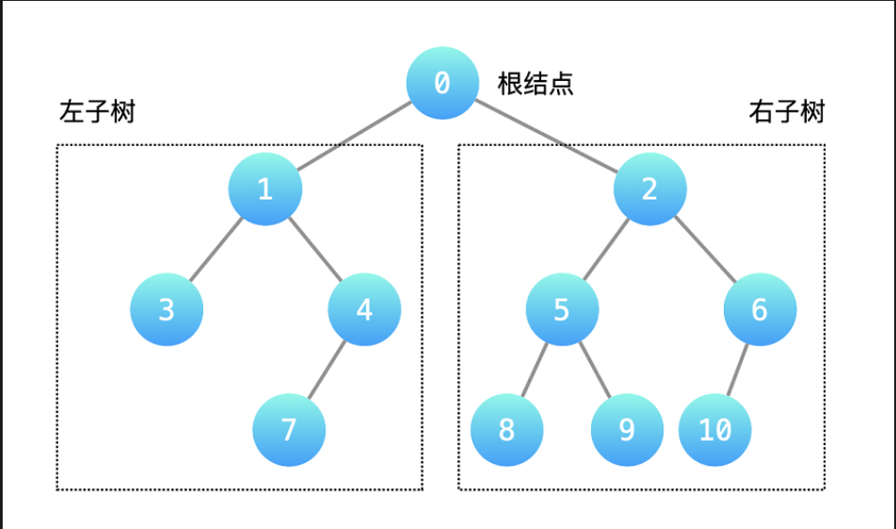

## 深度优先(遍历)搜索(dfs)
> __一条路走到底，不撞南墙不回头__ 是对$dfs$的最直观描述。

说明：
- dfs __只要前面有可以走的路__ ，就会一直向前走，直到无路可走才会回头。
- __无路可走__ 有两种情况： __遇到了墙__ 和 __遇到了已经走过的路了__。
- 有一些路径没有走到，是因为已经找到了出口，程序停止了。
- 搜索是把所有可能的情况都看一遍，搜索的结果就两种：__找到目标__ 或 __没找到__。
> **遍历** 和**搜索**可以看成两个等价的概念，通过遍历所有的可能情况达到搜索的目的。遍历是手段，搜索是目的。因此**深度优先遍历**也叫**深度优先搜索**。

### 1.树的深度优先遍历

以二叉树为例，深度优先遍历是从**根结点**开始，依次**递归**遍历**左子树**的所有结点和**右子树**的所有结点。当然，先遍历右子树再遍历左子树同样也是深度优先遍历，只是为了符合人们**从左往右**的习惯。

**二叉树深度遍历的递归终止条件**：遍历完**所有的叶子结点**,依据二叉树的定义，等价于遍历到**空结点**。

依据二叉树深度遍历的顺序，可以分为：**前序遍历**、**中序遍历**和**后序遍历**

对于这三种遍历形式，具有如下几个性质：
- 二叉树的**前序遍历**序列，跟结点一定是**最先**访问到的结点；
- 二叉树的**后序遍历**序列，跟结点一定是**最后**访问到的结点；
- **根节点**把二叉树的**中序遍历**划分成两个部分，第一部分的所有结点构成了根节点的**左子树**，第二部分的所有结点构成了根节点的**右子树**。

### 2. 图的深度优先遍历
> 深度优先遍历有**回头**的过程，在树中由于不存在**环**，对于每一个结点来说，每一个结点只会被递归处理一次。而**图**中由于存在**环**，就需要**记录已经被递归处理的结点(通常使用布尔数组或哈希表)**，以免结点被重复遍历。
> *深度优先遍历的结果通常与图的顶点如何存储有关，所以图的深度优先遍历的结果并不唯一。*